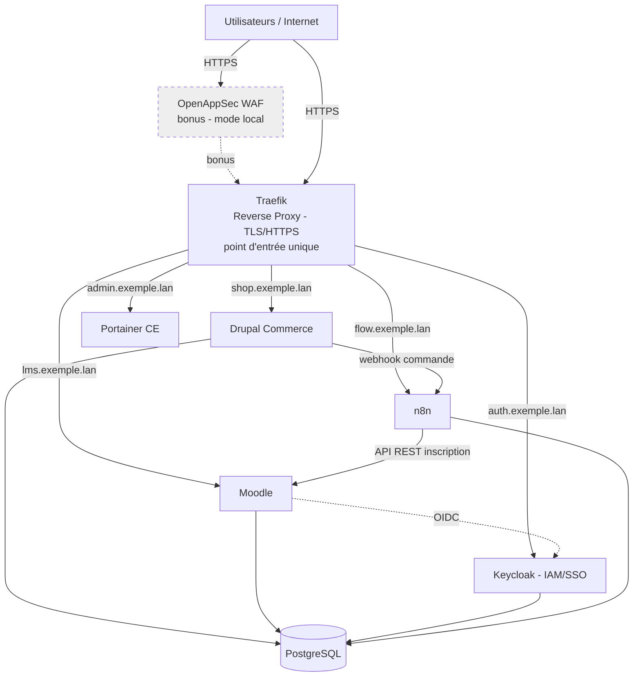

# Architecture générale — v2 (enrichie)

> Schéma conforme au déploiement réel. Trait plein = flux principal ;
> pointillé = bonus/optionnel. À mettre à jour à chaque changement.

```mermaid
%% ============================================================
%% Schéma 1 - Architecture générale (parcours métier)
%% Projet CR465 - Équipe Projet-CR465-D-Gaius
%% Règle : mettre à jour à chaque changement réel du déploiement
%% WAF et Redis = bonus (en pointillé)
%% ============================================================
flowchart TD
    Internet["Utilisateurs / Internet"]
    WAF["OpenAppSec WAF<br/>bonus - mode local"]
    Proxy["Traefik<br/>Reverse Proxy - TLS/HTTPS<br/>point d'entrée unique"]

    Internet -->|"HTTPS"| WAF
    WAF -.->|"bonus"| Proxy
    Internet -->|"HTTPS"| Proxy

    Proxy -->|"shop.exemple.lan"| Drupal["Drupal Commerce"]
    Proxy -->|"lms.exemple.lan"| Moodle["Moodle"]
    Proxy -->|"auth.exemple.lan"| Keycloak["Keycloak - IAM/SSO"]
    Proxy -->|"flow.exemple.lan"| N8N["n8n"]
    Proxy -->|"admin.exemple.lan"| Portainer["Portainer CE"]

    Drupal -->|"webhook commande"| N8N
    N8N -->|"API REST inscription"| Moodle
    Moodle -.->|"OIDC"| Keycloak

    Drupal --> Postgres[("PostgreSQL")]
    Moodle --> Postgres
    Keycloak --> Postgres
    N8N --> Postgres

    classDef optional stroke-dasharray:5,5,fill:#eee;
    class WAF optional;
```
