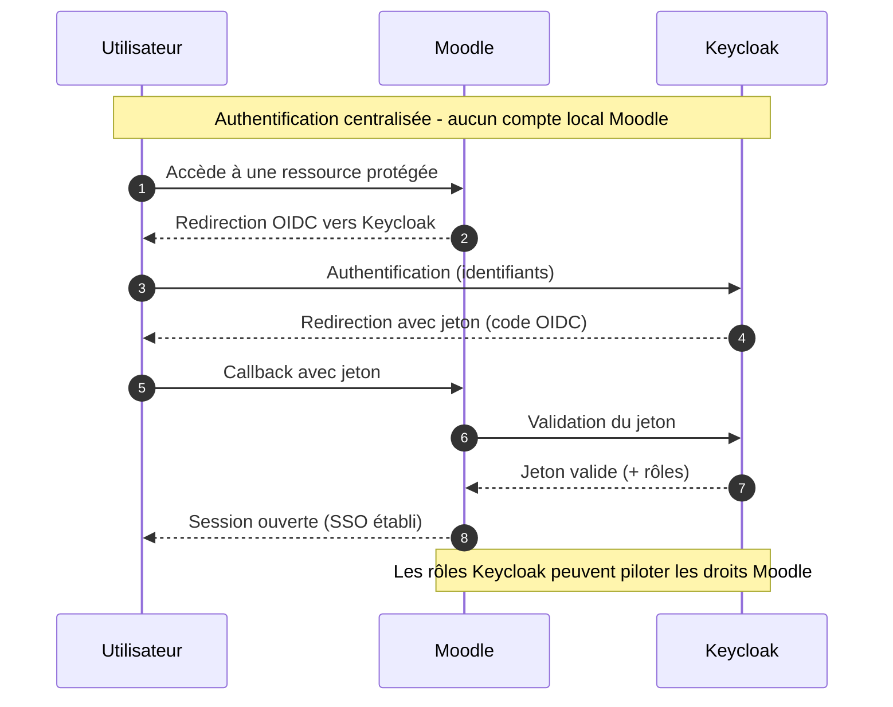

# Séquence SSO — Keycloak comme fournisseur d'identité (v2)

> Authentification unique (OIDC) entre Moodle et Keycloak.
> Aucun compte local Moodle : l'identité est centralisée dans Keycloak.

```mermaid
%% ============================================================
%% Schéma 4 - Séquence SSO (OIDC) Moodle <-> Keycloak
%% Keycloak = fournisseur d'identité unique (IAM)
%% Minimum exigé par la grille : SSO fonctionnel vers Moodle
%% ============================================================
sequenceDiagram
    autonumber
    participant U as Utilisateur
    participant M as Moodle
    participant K as Keycloak

    Note over U,K: Authentification centralisée - aucun compte local Moodle
    U->>M: Accède à une ressource protégée
    M-->>U: Redirection OIDC vers Keycloak
    U->>K: Authentification (identifiants)
    K-->>U: Redirection avec jeton (code OIDC)
    U->>M: Callback avec jeton
    M->>K: Validation du jeton
    K-->>M: Jeton valide (+ rôles)
    M-->>U: Session ouverte (SSO établi)

    Note over M,K: Les rôles Keycloak peuvent piloter les droits Moodle
```
